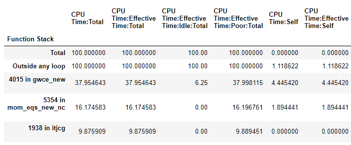
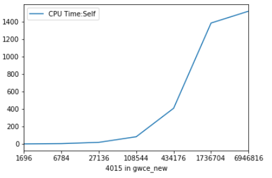
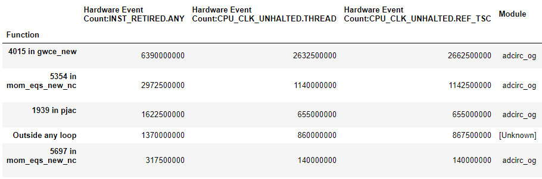
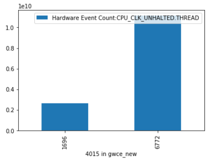
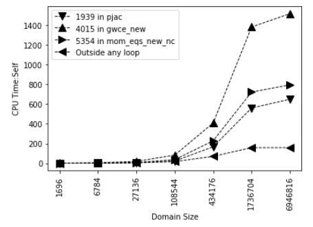

# Plotting Suite for Intel® Vtune Amplifier™

A set of python scripts to assist in generating publication style plots from CSV data produced by Vtune.

## Getting Started

### Plotting a pie chart showing where time is being spent
First, collect data using Vtune.  
Advanced hotspots is recommended to include individual loops rather than just functions.  

```
amplxe-cl --collect advanced-hotspots -r vtune_ah -- ./myexe
```

Generate a CSV report.  
```
amplxe-cl --report -report-output advanced-hotspots.csv -format csv -csv-delimiter comma -r vtune_ah
```

Plot  
```
python plot_pie.py advanced-hotspots.csv
```

An example CSV is included.  
```
python plot_pie.py ./data/advanced-hotspots.csv
```


### Plotting a bar graph showing the changes in distribution of where time is spent
Generate data at different # of MPI ranks and generate CSV reports.  
Name each CSV report how you'd like it to appear on the final plot.  
This can be useful for plotting strong scaling or a serial application with increasing domain size.  
Using this information you can determine which loops/functions are sensitive to domain size.

Plotting all the functions/loops would be too busy so instead data is cutoff either at % of total time or  
by total # of functions/loops to be displayed.


This example was generated by running increasingly large grids. The CSVs were named based on the resulting domain size.  

Plot
```
python plot_progression.py ./data/progression/*.csv
```

You can modify the call to the plot function to produce either stack, line, or bar graphs.  


You can also select plot targets by modifying the function call to override the default 'targets' parameter:  


You can get target names from your CSV data under the 'Function' column:
```
Function,CPU Time,CPU Time:Effective Time,CPU Time:Effective Time:Idle,CPU Time:Effective Time:Poor,CPU Time:Effective Time:Ok,CPU Time:Effective Time:Ideal,CPU Time:Effective Time:Over,CPU Time:Spin Time,CPU Time:Overhead Time,Instructions Retired,CPI Rate,CPU Frequency Ratio,Module,Function (Full),Source File,Start Address  
[Loop at line 4015 in gwce_new],1.067502,1.067502,0.004009,1.063493,0.0,0.0,0.0,0.0,0.0,6390000000,0.411972,0.988732,adcirc_og,[Loop at line 4015 in gwce_new],timestep.F,0x4c2b82  
[Loop at line 5354 in mom_eqs_new_nc],0.458074,0.458074,0.0,0.458074,0.0,0.0,0.0,0.0,0.0,2972500000,0.383516,0.997812,adcirc_og,[Loop at line 5354 in mom_eqs_new_nc],timestep.F,0x4d7602  
[Outside any loop],0.347815,0.347815,0.009021,0.338794,0.0,0.0,0.0,0.0,0.0,1370000000,0.627737,0.991354,[Unknown],[Outside any loop],[Unknown],0x0  
[Loop at line 1939 in pjac],0.262616,0.262616,0.0,0.262616,0.0,0.0,0.0,0.0,0.0,1622500000,0.403698,1.000000,adcirc_og,[Loop at line 1939 in pjac],itpackv.F,0x521b71  
```
From this data your target could be '[Loop at line 4015 in gwce_new]'  
or you can pass in 'total' and set pct_time argument=False to show overall CPU time changes between reports


### Jupyter Notebook
You can use VtuneCSV class to parse multiple CSV files from vtune and and use the get_frame() function  

Import the data, look at the available fields
```
topdown_files = os.listdir("./data/scaling/topdown")
topdown_files = ["./data/scaling/topdown/%s" % a for a in topdown_files]

topdown = VtuneCSV(topdown_files)
topdown.data[0].head()
```

```
df = topdown.get_frame("4015 in gwce_new", "CPU Time:Self")
df.plot()
plt.show()
```


Check what functions and data are present for reading
```
hwevents = VtuneCSV(["./data/scaling/hwevents/1696.csv", "./data/scaling/hwevents/6772.csv"])
hwevents.data[0].head()
```


Plot the selected data
```
df = hwevents.get_frame("4015 in gwce_new", "Hardware Event Count:CPU_CLK_UNHALTED.THREAD")
df.plot(kind='bar')
plt.show()
```


### Generating print-style scaling plots
```
topdown_files = os.listdir("./data/scaling/topdown")
topdown_files = ["./data/scaling/topdown/%s" % a for a in topdown_files]
topdown = VtuneCSV(topdown_files)

csv_names = [os.path.basename(a).split(".csv")[0] for a in topdown_files]
metric="CPU Time:Self"
df1 = topdown.get_frame("1939 in pjac", metric)
df2 = topdown.get_frame("4015 in gwce_new", metric)
df3 = topdown.get_frame("5354 in mom_eqs_new_nc", metric)
df4 = topdown.get_frame("Outside any loop", 'CPU Time:Self')

n = len(df1)
ax1 = plt.plot(np.arange(n),df1, linewidth=1, color='black', marker='v', markersize=10, linestyle='--')
ax2 = plt.plot(np.arange(n),df2, linewidth=1, color='black', marker="^", markersize=10, linestyle='--')
ax3 = plt.plot(np.arange(n),df3, linewidth=1, color='black', marker=">", markersize=10, linestyle='--')
ax4 = plt.plot(np.arange(n),df4, linewidth=1, color='black', marker="<", markersize=10, linestyle='--')

func_names = [df1.index.name, df2.index.name, df3.index.name, df4.index.name]
lgd = plt.legend(func_names, loc='best')
plt.xticks(np.arange(len(df1.index)), df1.index, rotation='vertical')
plt.xlabel("Domain Size")
plt.ylabel("CPU Time:Self")
plt.title("")

plt.show()
```



to get a custom pandas DataFrame object 

### Restrictions
*CSV report names are expected to be integers. The result will be displayed in ascending file name order.


### Prerequisites

Python 2.7  
Matplotlib - graphics  
Pandas - data handling  
Numpy - data handling  
