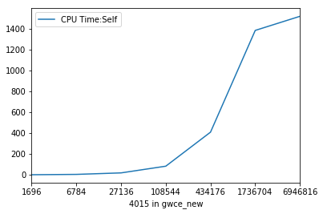
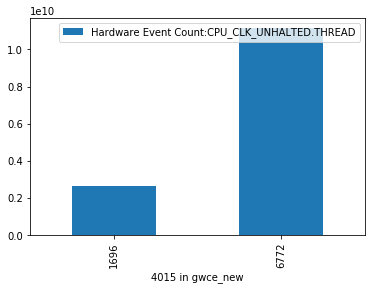
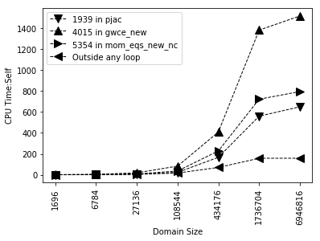

```python
import pandas as pd
import math
import sys
import os
import matplotlib.pyplot as plt
import numpy as np
from __future__ import print_function
class VtuneCSV():
    """
        Pass a list of strings containing paths to CSV files. 
        Each file name should only contain integers
            - These files will be plotted in ascending order based on filename
    """
    data = None
    names = None
    
    def __init__ (self, csv_list):
        self.data = []
        self.names = [os.path.basename(a).strip(".csv") for a in csv_list]
        if isinstance(csv_list, list) == False:
            csv_list = [csv_list]

        for csv_file in csv_list: 
            raw_data = pd.read_csv(csv_file)
            raw_data = self.remove_empty_cols(raw_data)
            raw_data = raw_data.dropna(axis=1, how="all") 
            function_col = raw_data.columns[0]
            raw_data = raw_data.set_index(function_col)
            raw_data = raw_data.drop(' [Unknown stack frame(s)]')
            raw_data = raw_data.rename(lambda x: x.strip(" []").replace("Loop at line ", ""))
            raw_data = raw_data.groupby(raw_data.index, sort=False).first()
            self.data.append(raw_data)
            
    def remove_empty_cols(self, raw_data):
        empties = (raw_data.iloc[:,:].sum() != 0)
        raw_data = raw_data.iloc[:,list(empties)]
        return raw_data
    
    def get_frame(self, function, metric):
        a= pd.DataFrame()
        for td in self.data:
            a = pd.concat([a, td[metric]])
        a.columns = [metric]
        a = a.loc[function]
        a.index = self.names
        a.index = [int(idx) for idx in list(a.index)]
        a = a.sort_index(ascending=True)
        a.index = [str(idx) for idx in list(a.index)]
        a.index.name = function
        return a
    

        


```


```python
topdown_files = os.listdir("./data/scaling/topdown")
topdown_files = ["./data/scaling/topdown/%s" % a for a in topdown_files]
```


```python
topdown = VtuneCSV(topdown_files)
topdown.data[0].head()
```


<div>
<style>
    .dataframe thead tr:only-child th {
        text-align: right;
    }

    .dataframe thead th {
        text-align: left;
    }

    .dataframe tbody tr th {
        vertical-align: top;
    }
</style>
<table border="1" class="dataframe">
  <thead>
    <tr style="text-align: right;">
      <th></th>
      <th>CPU Time:Total</th>
      <th>CPU Time:Effective Time:Total</th>
      <th>CPU Time:Effective Time:Idle:Total</th>
      <th>CPU Time:Effective Time:Poor:Total</th>
      <th>CPU Time:Self</th>
      <th>CPU Time:Effective Time:Self</th>
      <th>CPU Time:Effective Time:Idle:Self</th>
      <th>CPU Time:Effective Time:Poor:Self</th>
      <th>Instructions Retired:Total</th>
      <th>Instructions Retired:Self</th>
      <th>CPI Rate:Total</th>
      <th>CPI Rate:Self</th>
      <th>CPU Frequency Ratio:Total</th>
      <th>CPU Frequency Ratio:Self</th>
      <th>Module</th>
      <th>Function (Full)</th>
      <th>Source File</th>
      <th>Start Address</th>
    </tr>
    <tr>
      <th>Function Stack</th>
      <th></th>
      <th></th>
      <th></th>
      <th></th>
      <th></th>
      <th></th>
      <th></th>
      <th></th>
      <th></th>
      <th></th>
      <th></th>
      <th></th>
      <th></th>
      <th></th>
      <th></th>
      <th></th>
      <th></th>
      <th></th>
    </tr>
  </thead>
  <tbody>
    <tr>
      <th>Total</th>
      <td>100.000000</td>
      <td>100.000000</td>
      <td>100.00</td>
      <td>100.000000</td>
      <td>0.000000</td>
      <td>0.000000</td>
      <td>0.000000</td>
      <td>0.000000</td>
      <td>100.000000</td>
      <td>0</td>
      <td>100.000000</td>
      <td>0.000000</td>
      <td>100.000000</td>
      <td>0.000000</td>
      <td>[Unknown]</td>
      <td>[Unknown]</td>
      <td>[Unknown]</td>
      <td>[Unknown]</td>
    </tr>
    <tr>
      <th>Outside any loop</th>
      <td>100.000000</td>
      <td>100.000000</td>
      <td>100.00</td>
      <td>100.000000</td>
      <td>1.118622</td>
      <td>1.118622</td>
      <td>0.011026</td>
      <td>1.107596</td>
      <td>100.000000</td>
      <td>4452500000</td>
      <td>100.000000</td>
      <td>0.612577</td>
      <td>100.000000</td>
      <td>0.977599</td>
      <td>[Unknown]</td>
      <td>[Outside any loop]</td>
      <td>[Unknown]</td>
      <td>0x0</td>
    </tr>
    <tr>
      <th>4015 in gwce_new</th>
      <td>37.954643</td>
      <td>37.954643</td>
      <td>6.25</td>
      <td>37.998115</td>
      <td>4.445420</td>
      <td>4.445420</td>
      <td>0.001002</td>
      <td>4.444418</td>
      <td>41.991395</td>
      <td>25862500000</td>
      <td>90.806055</td>
      <td>0.430256</td>
      <td>100.463939</td>
      <td>1.003608</td>
      <td>adcirc_og</td>
      <td>[Loop at line 4015 in gwce_new]</td>
      <td>timestep.F</td>
      <td>0x4c2b82</td>
    </tr>
    <tr>
      <th>5354 in mom_eqs_new_nc</th>
      <td>16.174583</td>
      <td>16.174583</td>
      <td>0.00</td>
      <td>16.196761</td>
      <td>1.894441</td>
      <td>1.894441</td>
      <td>0.000000</td>
      <td>1.894441</td>
      <td>19.150836</td>
      <td>11795000000</td>
      <td>84.322044</td>
      <td>0.399534</td>
      <td>99.837979</td>
      <td>0.997354</td>
      <td>adcirc_og</td>
      <td>[Loop at line 5354 in mom_eqs_new_nc]</td>
      <td>timestep.F</td>
      <td>0x4d7602</td>
    </tr>
    <tr>
      <th>1938 in itjcg</th>
      <td>9.875909</td>
      <td>9.875909</td>
      <td>0.00</td>
      <td>9.889451</td>
      <td>0.000000</td>
      <td>0.000000</td>
      <td>0.000000</td>
      <td>0.000000</td>
      <td>9.689073</td>
      <td>0</td>
      <td>102.209938</td>
      <td>0.000000</td>
      <td>100.276290</td>
      <td>0.000000</td>
      <td>adcirc_og</td>
      <td>[Loop at line 1938 in itjcg]</td>
      <td>itpackv.F</td>
      <td>0x521a43</td>
    </tr>
  </tbody>
</table>
</div>


```python
df = topdown.get_frame("4015 in gwce_new", "CPU Time:Self")
df.plot()
plt.show()
```





```python
hwevents = VtuneCSV(["./data/scaling/hwevents/1696.csv", "./data/scaling/hwevents/6772.csv"])
hwevents.data[0].head()


```


<div>
<style>
    .dataframe thead tr:only-child th {
        text-align: right;
    }

    .dataframe thead th {
        text-align: left;
    }

    .dataframe tbody tr th {
        vertical-align: top;
    }
</style>
<table border="1" class="dataframe">
  <thead>
    <tr style="text-align: right;">
      <th></th>
      <th>Hardware Event Count:INST_RETIRED.ANY</th>
      <th>Hardware Event Count:CPU_CLK_UNHALTED.THREAD</th>
      <th>Hardware Event Count:CPU_CLK_UNHALTED.REF_TSC</th>
      <th>Module</th>
      <th>Function (Full)</th>
      <th>Source File</th>
      <th>Start Address</th>
    </tr>
    <tr>
      <th>Function</th>
      <th></th>
      <th></th>
      <th></th>
      <th></th>
      <th></th>
      <th></th>
      <th></th>
    </tr>
  </thead>
  <tbody>
    <tr>
      <th>4015 in gwce_new</th>
      <td>6390000000</td>
      <td>2632500000</td>
      <td>2662500000</td>
      <td>adcirc_og</td>
      <td>[Loop at line 4015 in gwce_new]</td>
      <td>timestep.F</td>
      <td>0x4c2b82</td>
    </tr>
    <tr>
      <th>5354 in mom_eqs_new_nc</th>
      <td>2972500000</td>
      <td>1140000000</td>
      <td>1142500000</td>
      <td>adcirc_og</td>
      <td>[Loop at line 5354 in mom_eqs_new_nc]</td>
      <td>timestep.F</td>
      <td>0x4d7602</td>
    </tr>
    <tr>
      <th>1939 in pjac</th>
      <td>1622500000</td>
      <td>655000000</td>
      <td>655000000</td>
      <td>adcirc_og</td>
      <td>[Loop at line 1939 in pjac]</td>
      <td>itpackv.F</td>
      <td>0x521b71</td>
    </tr>
    <tr>
      <th>Outside any loop</th>
      <td>1370000000</td>
      <td>860000000</td>
      <td>867500000</td>
      <td>[Unknown]</td>
      <td>[Outside any loop]</td>
      <td>[Unknown]</td>
      <td>0x0</td>
    </tr>
    <tr>
      <th>5697 in mom_eqs_new_nc</th>
      <td>317500000</td>
      <td>140000000</td>
      <td>140000000</td>
      <td>adcirc_og</td>
      <td>[Loop at line 5697 in mom_eqs_new_nc]</td>
      <td>timestep.F</td>
      <td>0x4d8aa1</td>
    </tr>
  </tbody>
</table>
</div>


```python
df = hwevents.get_frame("4015 in gwce_new", "Hardware Event Count:CPU_CLK_UNHALTED.THREAD")
df.plot(kind='bar')
plt.show()
```





```python
topdown_files = os.listdir("./data/scaling/topdown")
topdown_files = ["./data/scaling/topdown/%s" % a for a in topdown_files]
topdown = VtuneCSV(topdown_files)

csv_names = [os.path.basename(a).split(".csv")[0] for a in topdown_files]
metric="CPU Time:Self"
df1 = topdown.get_frame("1939 in pjac", metric)
df2 = topdown.get_frame("4015 in gwce_new", metric)
df3 = topdown.get_frame("5354 in mom_eqs_new_nc", metric)
df4 = topdown.get_frame("Outside any loop", 'CPU Time:Self')

n = len(df1)
ax1 = plt.plot(np.arange(n),df1, linewidth=1, color='black', marker='v', markersize=10, linestyle='--')
ax2 = plt.plot(np.arange(n),df2, linewidth=1, color='black', marker="^", markersize=10, linestyle='--')
ax3 = plt.plot(np.arange(n),df3, linewidth=1, color='black', marker=">", markersize=10, linestyle='--')
ax4 = plt.plot(np.arange(n),df4, linewidth=1, color='black', marker="<", markersize=10, linestyle='--')

func_names = [df1.index.name, df2.index.name, df3.index.name, df4.index.name]
lgd = plt.legend(func_names, loc='best')
plt.xticks(np.arange(len(df1.index)), df1.index, rotation='vertical')
plt.xlabel("Domain Size")
plt.ylabel("CPU Time:Self")
plt.title("")

plt.show()
```




